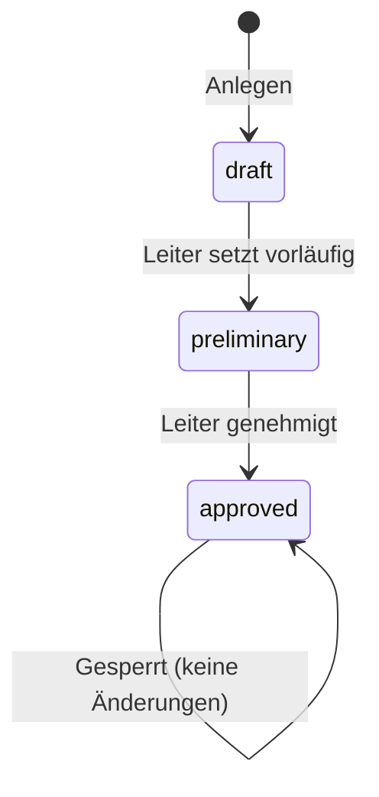
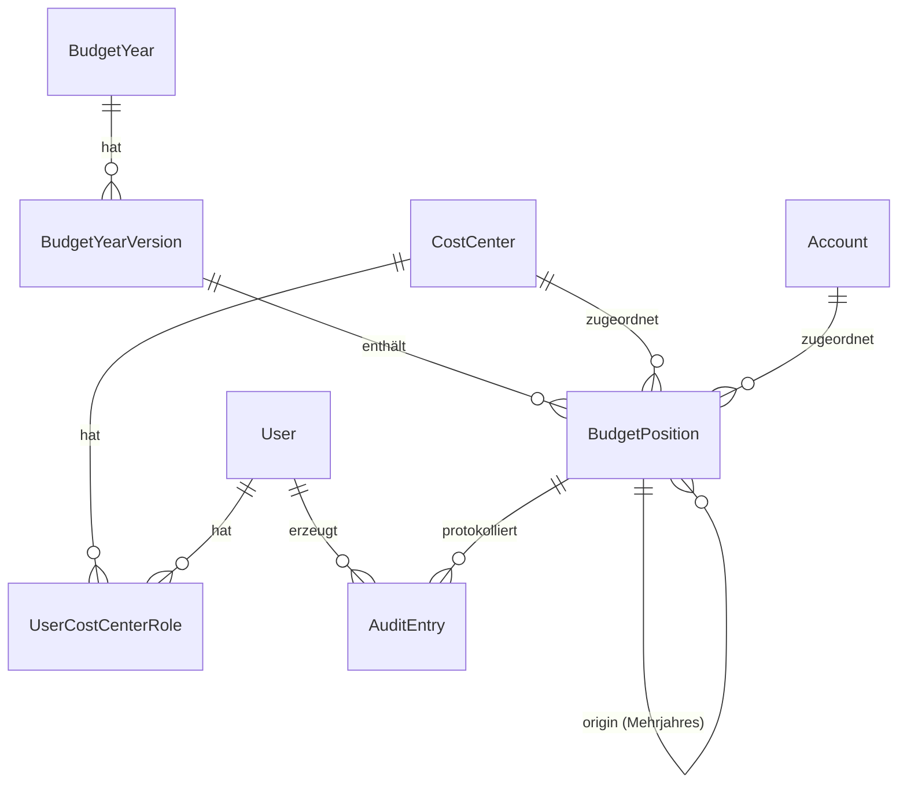

# Design-Dokument – Haushaltsplanung (HH)

## Übersicht

Das Modul „Haushaltsplanung (HH)" wird als eigenständiges Laravel-Modul unter `app/Modules/HH/` in das IT-Cockpit integriert. Es folgt der bestehenden Modularchitektur (vgl. `app/Modules/Network/`) mit Controllers, Models, Services, Requests, Routes und Views.

Das Modul verwaltet Haushaltsjahre, Kostenstellen, Sachkonten und Haushaltspositionen. Es implementiert ein kostenstellenbezogenes Rechtekonzept mit vier Rollen, eine revisionssichere Versionierung, Mehrjahresplanung, ein Audit Trail sowie Export- und Dashboard-Funktionen. Die Integration mit dem Bestellwesen erfolgt über eine interne Service-Schnittstelle.

---

## Architektur

Das Modul folgt dem Laravel-MVC-Muster innerhalb der bestehenden Modulstruktur des IT-Cockpits.

```
app/Modules/HH/
├── Console/
├── Database/
│   ├── Migrations/
│   └── Seeders/
├── Http/
│   ├── Controllers/
│   └── Requests/
├── Models/
├── Providers/
├── Routes/
│   ├── web.php
│   └── api.php
├── Services/
├── Views/
│   └── (Blade-Templates)
└── module.json
```

### Schichtenmodell

```
┌─────────────────────────────────────────────┐
│              Views (Blade)                  │
├─────────────────────────────────────────────┤
│           HTTP Controllers                  │
│  (BudgetYearController, PositionController, │
│   CostCenterController, AccountController,  │
│   DashboardController, ExportController,    │
│   AuditController)                          │
├─────────────────────────────────────────────┤
│              Services                       │
│  (BudgetYearService, PositionService,       │
│   MultiYearPlanningService,                 │
│   BudgetCalculationService,                 │
│   ExportService, AuditService,              │
│   AuthorizationService)                     │
├─────────────────────────────────────────────┤
│              Models (Eloquent)              │
│  (BudgetYear, BudgetYearVersion,            │
│   CostCenter, Account, BudgetPosition,      │
│   UserCostCenterRole, AuditEntry)           │
├─────────────────────────────────────────────┤
│           Datenbank (MySQL)                 │
└─────────────────────────────────────────────┘
```

### Statusübergänge Haushaltsjahr



---

## Komponenten und Schnittstellen

### Controllers

| Controller | Verantwortlichkeit |
|---|---|
| `BudgetYearController` | CRUD für Haushaltsjahre, Statusübergänge |
| `BudgetYearVersionController` | Versionsverwaltung |
| `CostCenterController` | CRUD für Kostenstellen, Rechtevergabe |
| `AccountController` | CRUD für Sachkonten |
| `BudgetPositionController` | CRUD für Haushaltspositionen |
| `DashboardController` | Aggregierte Budgetübersicht |
| `ExportController` | Excel- und PDF-Export |
| `AuditController` | Anzeige des Änderungsprotokolls |

### Services

**`AuthorizationService`**
- `canAccessCostCenter(User $user, CostCenter $cc, string $minRole): bool`
- `getUserRoleForCostCenter(User $user, CostCenter $cc): ?string`
- `isLeiter(User $user): bool`

**`BudgetYearService`**
- `create(int $year): BudgetYear`
- `transitionStatus(BudgetYear $by, string $newStatus, User $actor): void`
- `createVersion(BudgetYear $by, User $actor): BudgetYearVersion`

**`PositionService`**
- `create(array $data, User $actor): BudgetPosition`
- `update(BudgetPosition $pos, array $data, User $actor): BudgetPosition`
- `delete(BudgetPosition $pos, User $actor): void`

**`MultiYearPlanningService`**
- `propagateRecurring(BudgetYear $by): void`
- `generateForDateRange(BudgetPosition $pos): void`

**`BudgetCalculationService`**
- `getAvailableBudget(BudgetYear $by, CostCenter $cc, Account $acc): float`
- `getTotals(BudgetYear $by): array`
- `getInvestiveShare(BudgetYear $by): float`

**`ExportService`**
- `exportExcel(BudgetYear $by, User $actor): \Symfony\Component\HttpFoundation\StreamedResponse`
- `exportPdf(BudgetYear $by, User $actor): \Symfony\Component\HttpFoundation\Response`

**`AuditService`**
- `log(User $actor, string $entityType, int $entityId, string $field, mixed $oldValue, mixed $newValue): void`
- `getEntries(array $filters): Collection`

### Bestellwesen-Integration

Der `BudgetCalculationService` stellt eine interne PHP-Schnittstelle bereit, die vom Bestellwesen-Modul aufgerufen wird:

```php
// Lesender Zugriff durch das Bestellwesen
$available = app(BudgetCalculationService::class)
    ->getAvailableBudget($budgetYear, $costCenter, $account);
```

Bei Überschreitung gibt `getAvailableBudget` einen negativen Wert zurück; das Bestellwesen wertet diesen als Warnhinweis.

---

## Datenmodelle

### Tabelle: `hh_budget_years`

| Spalte | Typ | Beschreibung |
|---|---|---|
| `id` | bigint PK | |
| `year` | smallint UNIQUE | Kalenderjahr |
| `status` | enum('draft','preliminary','approved') | |
| `created_by` | bigint FK users | |
| `created_at` | timestamp | |
| `updated_at` | timestamp | |

### Tabelle: `hh_budget_year_versions`

| Spalte | Typ | Beschreibung |
|---|---|---|
| `id` | bigint PK | |
| `budget_year_id` | bigint FK | |
| `version_number` | smallint | Laufende Nummer |
| `is_active` | boolean | Genau eine Version aktiv |
| `created_by` | bigint FK users | |
| `created_at` | timestamp | |

### Tabelle: `hh_cost_centers`

| Spalte | Typ | Beschreibung |
|---|---|---|
| `id` | bigint PK | |
| `number` | varchar(20) UNIQUE | z. B. 143011 |
| `name` | varchar(255) | z. B. IUK |
| `is_active` | boolean | |
| `created_at` | timestamp | |
| `updated_at` | timestamp | |

### Tabelle: `hh_accounts`

| Spalte | Typ | Beschreibung |
|---|---|---|
| `id` | bigint PK | |
| `number` | varchar(20) UNIQUE | z. B. 0121002 |
| `name` | varchar(255) | z. B. Software |
| `type` | enum('investiv','konsumtiv') | |
| `is_active` | boolean | |
| `created_at` | timestamp | |
| `updated_at` | timestamp | |

### Tabelle: `hh_budget_positions`

| Spalte | Typ | Beschreibung |
|---|---|---|
| `id` | bigint PK | |
| `budget_year_version_id` | bigint FK | |
| `cost_center_id` | bigint FK | |
| `account_id` | bigint FK | |
| `project_name` | varchar(255) | |
| `description` | text NULL | |
| `amount` | decimal(12,2) | Brutto in Euro, > 0 |
| `start_year` | smallint NULL | |
| `end_year` | smallint NULL | |
| `is_recurring` | boolean | |
| `priority` | enum('hoch','mittel','niedrig') | |
| `category` | enum('Pflichtaufgabe','gesetzlich gebunden','freiwillige Leistung') | |
| `status` | enum('geplant','angepasst','gestrichen') | |
| `origin_position_id` | bigint NULL FK self | Für Mehrjahres-Kopien |
| `created_by` | bigint FK users | |
| `created_at` | timestamp | |
| `updated_at` | timestamp | |

### Tabelle: `hh_user_cost_center_roles`

| Spalte | Typ | Beschreibung |
|---|---|---|
| `id` | bigint PK | |
| `user_id` | bigint FK users | |
| `cost_center_id` | bigint FK | |
| `role` | enum('Leiter','Teamleiter','Mitarbeiter','Audit_Zugang') | |
| `created_at` | timestamp | |
| `updated_at` | timestamp | |

Unique-Constraint: `(user_id, cost_center_id)`

### Tabelle: `hh_audit_entries`

| Spalte | Typ | Beschreibung |
|---|---|---|
| `id` | bigint PK | |
| `user_id` | bigint FK users | |
| `entity_type` | varchar(100) | z. B. `BudgetPosition`, `BudgetYear` |
| `entity_id` | bigint | |
| `field` | varchar(100) | Geändertes Feld |
| `old_value` | text NULL | |
| `new_value` | text NULL | |
| `created_at` | timestamp | Unveränderlich |

Keine `updated_at`-Spalte; Einträge sind immutable.

### Entity-Relationship-Diagramm



---

## Korrektheitseigenschaften

*Eine Eigenschaft (Property) ist ein Merkmal oder Verhalten, das für alle gültigen Ausführungen eines Systems gelten soll – im Wesentlichen eine formale Aussage darüber, was das System tun soll. Eigenschaften dienen als Brücke zwischen menschenlesbaren Spezifikationen und maschinell verifizierbaren Korrektheitsnachweisen.*


### Eigenschaft 1: Eindeutigkeit von Haushaltsjahren

*Für jedes* Kalenderjahr gilt: Das System darf nicht mehr als ein Haushaltsjahr mit demselben Jahr anlegen. Ein zweiter Anlege-Versuch für dasselbe Jahr muss abgelehnt werden.

**Validates: Anforderungen 1.1**

---

### Eigenschaft 2: Initialstatus beim Anlegen

*Für jede* neu angelegte Entität gilt: Haushaltsjahre werden mit Status `draft` initialisiert; Kostenstellen und Sachkonten werden mit `is_active = true` initialisiert.

**Validates: Anforderungen 1.2, 2.2, 3.2**

---

### Eigenschaft 3: Statusübergangs-Reihenfolge

*Für jedes* Haushaltsjahr gilt: Nur die Übergänge `draft → preliminary` und `preliminary → approved` sind erlaubt. Alle anderen Übergänge (z. B. `draft → approved`, `approved → draft`, `preliminary → draft`) müssen abgelehnt werden.

**Validates: Anforderungen 1.6**

---

### Eigenschaft 4: Sperrung nach Genehmigung

*Für jedes* Haushaltsjahr mit Status `approved` gilt: Jeder Versuch, Haushaltspositionen zu erstellen, zu ändern oder zu löschen, muss abgelehnt werden – unabhängig von der Rolle des Benutzers.

**Validates: Anforderungen 1.4, 1.5, 4.6**

---

### Eigenschaft 5: Inaktive Stammdaten blockieren neue Positionen

*Für jede* inaktive Kostenstelle oder jedes inaktive Sachkonto gilt: Das Anlegen einer neuen Haushaltsposition, die auf diese Entität verweist, muss abgelehnt werden. Bestehende Positionen bleiben unverändert erhalten.

**Validates: Anforderungen 2.3, 2.4, 3.3, 3.4**

---

### Eigenschaft 6: Berechtigungsvalidierung beim Anlegen von Positionen

*Für jeden* Benutzer ohne Schreibrecht auf eine Kostenstelle gilt: Das Anlegen einer Haushaltsposition für diese Kostenstelle muss abgelehnt werden.

**Validates: Anforderungen 4.3, 9.7**

---

### Eigenschaft 7: Schreibzugriff nach Haushaltsjahr-Status

*Für jedes* Haushaltsjahr mit Status `preliminary` gilt: Nur Benutzer mit der Rolle `Leiter` dürfen Haushaltspositionen bearbeiten. Teamleiter und Mitarbeiter müssen abgewiesen werden.

**Validates: Anforderungen 4.4, 4.5**

---

### Eigenschaft 8: Audit-Trail-Vollständigkeit

*Für jeden* Schreibvorgang auf Haushaltspositionen oder Statusänderungen von Haushaltsjahren gilt: Im Audit_Trail muss ein Eintrag mit Benutzer, Zeitstempel, Feldname, altem Wert und neuem Wert existieren.

**Validates: Anforderungen 4.8, 10.1, 10.2, 10.3, 10.4**

---

### Eigenschaft 9: Immutabilität des Audit Trails

*Für jeden* Audit-Eintrag gilt: Update- und Delete-Operationen auf `hh_audit_entries` müssen abgelehnt werden.

**Validates: Anforderungen 10.5**

---

### Eigenschaft 10: Mehrjahresplanung – Laufzeitbasierte Positionsanzahl

*Für jede* Haushaltsposition mit Startjahr `s` und Endjahr `e` (wobei `e >= s`) gilt: Die Anzahl der automatisch erzeugten Positionen beträgt genau `e - s + 1`, und jede erzeugte Position besitzt dieselben Attribute wie die Ursprungsposition (außer dem Haushaltsjahr).

**Validates: Anforderungen 5.2, 5.4**

---

### Eigenschaft 11: Validierung ungültiger Laufzeiten

*Für jede* Haushaltsposition, bei der `end_year < start_year` gilt: Die Eingabe muss abgelehnt werden.

**Validates: Anforderungen 5.3**

---

### Eigenschaft 12: Wiederkehrende Positionen – Propagierung

*Für jede* als wiederkehrend markierte Haushaltsposition gilt: Nach dem Aufruf von `propagateRecurring` existiert im Folgejahr eine Position mit identischen Attributen (außer dem Haushaltsjahr).

**Validates: Anforderungen 5.1, 5.4**

---

### Eigenschaft 13: Versionierung – Positionskopie

*Für jedes* Haushaltsjahr mit `n` Positionen gilt: Nach dem Erstellen einer neuen Version enthält die neue Version ebenfalls genau `n` Positionen mit identischen Attributen.

**Validates: Anforderungen 6.2**

---

### Eigenschaft 14: Genau eine aktive Version

*Für jedes* Haushaltsjahr gilt: Zu jedem Zeitpunkt ist genau eine Version als aktiv (`is_active = true`) markiert. Nach dem Erstellen einer neuen Version ist die vorherige Version nicht mehr aktiv.

**Validates: Anforderungen 6.3, 6.4**

---

### Eigenschaft 15: Budget-Kennzahlen-Konsistenz

*Für jedes* Haushaltsjahr gilt: `Gesamtbudget = Investiv gesamt + Konsumtiv gesamt`. Die Teilsummen nach Kostenstelle addieren sich zum Gesamtbudget. Der Anteil Investiv berechnet sich als `(Investiv gesamt / Gesamtbudget) * 100` (bei Gesamtbudget = 0 ist der Anteil 0).

**Validates: Anforderungen 7.1, 7.2, 7.4, 7.5**

---

### Eigenschaft 16: Verfügbares Budget

*Für jede* Kombination aus Haushaltsjahr, Kostenstelle und Sachkonto gilt: `Verfügbares Budget = Geplantes Budget − Summe der Bestellungen`. Bei Überschreitung ist der Rückgabewert negativ.

**Validates: Anforderungen 8.1, 8.3**

---

### Eigenschaft 17: Audit_Zugang – Kein Schreibzugriff

*Für jeden* Benutzer mit der Rolle `Audit_Zugang` gilt: Jeder Schreibversuch (Anlegen, Bearbeiten, Löschen) auf beliebige Entitäten des Moduls muss abgelehnt werden.

**Validates: Anforderungen 9.6**

---

### Eigenschaft 18: Kostenstellenbezogene Rollenzuweisung – Round-Trip

*Für jeden* Benutzer und jede Kostenstelle gilt: Eine zugewiesene Rolle kann korrekt abgerufen werden (`getUserRoleForCostCenter` gibt die zugewiesene Rolle zurück).

**Validates: Anforderungen 2.5, 9.2**

---

### Eigenschaft 19: Audit-Trail-Filterung

*Für jeden* Satz von Filterparametern (Haushaltsjahr, Kostenstelle, Zeitraum) gilt: Die zurückgegebenen Audit-Einträge enthalten ausschließlich Einträge, die den Filterkriterien entsprechen.

**Validates: Anforderungen 10.6**

---

### Eigenschaft 20: Export-Vollständigkeit und Zugriffsschutz

*Für jeden* Export-Aufruf gilt: (a) Alle Pflichtfelder je Position sind enthalten; (b) Die Summen im Export stimmen mit den berechneten Werten überein; (c) Positionen von Kostenstellen, auf die der exportierende Benutzer keinen Lesezugriff hat, sind nicht enthalten.

**Validates: Anforderungen 11.2, 11.3, 11.4**

---

## Fehlerbehandlung

| Fehlerfall | Verhalten |
|---|---|
| Haushaltsjahr für bestehendes Jahr anlegen | HTTP 422, Fehlermeldung mit Jahresangabe |
| Ungültiger Statusübergang | HTTP 422, Fehlermeldung mit erlaubten Übergängen |
| Bearbeitung eines approved Haushaltsjahres | HTTP 403, Fehlermeldung |
| Position auf inaktiver Kostenstelle/Sachkonto | HTTP 422, Fehlermeldung |
| Fehlende Kostenstellen-Berechtigung | HTTP 403, Fehlermeldung |
| end_year < start_year | HTTP 422, Fehlermeldung |
| Schreibversuch durch Audit_Zugang | HTTP 403, Fehlermeldung |
| Betrag ≤ 0 | HTTP 422, Fehlermeldung |
| Bestellwesen: Budget überschritten | Rückgabe negativer Wert + Warnhinweis-Flag |

Alle Fehlerantworten folgen dem Laravel-Standard-JSON-Format:
```json
{
  "message": "Fehlerbeschreibung",
  "errors": { "field": ["Validierungsfehler"] }
}
```

---

## Teststrategie

### Dualer Testansatz

Das Modul wird mit zwei komplementären Testarten abgedeckt:

**Unit-Tests / Feature-Tests (PHPUnit)**
- Spezifische Beispiele und Randfälle
- Integrationspunkte zwischen Komponenten (z. B. Service → Model)
- Fehlerbehandlung und Validierungsregeln
- Laravel Feature Tests für HTTP-Endpunkte

**Property-Based Tests (Pest PHP + `spatie/pest-plugin-test-time` oder `eris/eris`)**
- Universelle Eigenschaften über beliebige Eingaben
- Mindestens 100 Iterationen pro Property-Test
- Jeder Property-Test referenziert die Design-Eigenschaft

### Property-Test-Konfiguration

Empfohlene Bibliothek: **`giorgiosironi/eris`** (PHP Property-Based Testing) oder alternativ manuelle Generatoren mit Pest.

Jeder Property-Test wird mit folgendem Kommentar annotiert:

```php
// Feature: budget-planning-module, Property N: <Eigenschaftstext>
```

### Testabdeckung je Eigenschaft

| Eigenschaft | Testtyp | Beschreibung |
|---|---|---|
| 1 – Eindeutigkeit Haushaltsjahre | Property | Zufällige Jahreswerte, Duplikat-Anlage |
| 2 – Initialstatus | Property | Beliebige Entitäten anlegen, Status prüfen |
| 3 – Statusübergangs-Reihenfolge | Property | Alle ungültigen Übergänge generieren |
| 4 – Sperrung nach Genehmigung | Property | Beliebige Aktionen auf approved-Jahres |
| 5 – Inaktive Stammdaten | Property | Inaktive KST/Sachkonto + Positions-Anlage |
| 6 – Berechtigungsvalidierung | Property | Benutzer ohne Recht + Positions-Anlage |
| 7 – Schreibzugriff nach Status | Property | Teamleiter/Mitarbeiter auf preliminary |
| 8 – Audit-Trail-Vollständigkeit | Property | Beliebige Schreibvorgänge, Audit prüfen |
| 9 – Audit-Immutabilität | Property | Update/Delete auf Audit-Einträge |
| 10 – Laufzeitbasierte Positionsanzahl | Property | Zufällige Start/End-Kombinationen |
| 11 – Ungültige Laufzeiten | Property | end_year < start_year |
| 12 – Wiederkehrende Propagierung | Property | Beliebige wiederkehrende Positionen |
| 13 – Versionskopie | Property | Beliebige Positionsmengen, Version erstellen |
| 14 – Genau eine aktive Version | Property | Mehrfaches Erstellen von Versionen |
| 15 – Budget-Kennzahlen-Konsistenz | Property | Beliebige Positionsmengen, Summen prüfen |
| 16 – Verfügbares Budget | Property | Beliebige Budget/Bestellungs-Kombinationen |
| 17 – Audit_Zugang kein Schreibzugriff | Property | Beliebige Schreibversuche |
| 18 – Rollenzuweisung Round-Trip | Property | Beliebige Benutzer/Kostenstellen-Paare |
| 19 – Audit-Filterung | Property | Beliebige Filterparameter |
| 20 – Export-Vollständigkeit | Property | Beliebige Haushaltsjahre exportieren |
