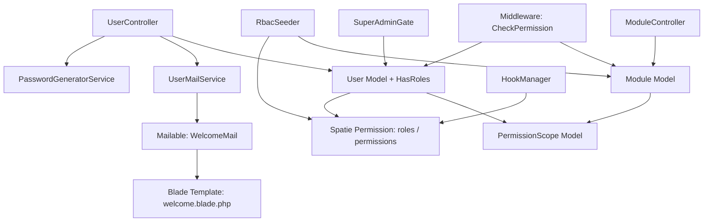

# Design-Dokument: Benutzerverwaltung mit RBAC

## Übersicht

Das IT-Cockpit nutzt bereits `spatie/laravel-permission` (^6.24) und das `HasRoles`-Trait im `User`-Model. Dieses Design erweitert die bestehende Infrastruktur um ein flexibles, modulbasiertes Rechtesystem:

1. **Basismodul-Funktionen**: `PasswordGeneratorService`, `UserMailService`, E-Mail-Templates
2. **Modulbasierte Architektur**: Trennung zwischen Basismodul (globale Funktionen) und Fachmodulen
3. **Superadministrator-Rolle**: Uneingeschränkter Zugriff auf alle Module
4. **Modulverwaltung**: `Module`-Model mit Aktivierung/Deaktivierung zur Laufzeit
5. **Feingranulare Zugriffssteuerung**: Optional Scopes für Untereinheiten (z.B. Kostenstellen)
6. **Erweiterte RBAC-Struktur**: `RbacSeeder` mit Basismodul- und Fachmodul-Berechtigungen
7. **Modulspezifische Berechtigungen**: Format `{modul}.{aktion}` mit Referenz auf Module

Das bestehende `role`-Enum-Feld in der `users`-Tabelle wird durch das Spatie-RBAC-System ersetzt. Die `is_active`-Spalte bleibt erhalten.

---

## Architektur



### Schichtenmodell

- **Controller-Schicht**: `UserController`, `ModuleController` orchestrieren Geschäftslogik
- **Service-Schicht**: `PasswordGeneratorService`, `UserMailService`, `ModuleService` – zustandslos, testbar
- **Model-Schicht**: `User` mit `HasRoles`-Trait (Spatie), `Module`, `PermissionScope`
- **Middleware-Schicht**: `EnsureUserIsActive`, `CheckModuleAccess`, `SuperAdminGate`
- **Infrastruktur**: Spatie-Tabellen + erweiterte Tabellen (`modules`, `permission_scopes`)

---

## Komponenten und Schnittstellen

### PasswordGeneratorService

```php
namespace App\Services;

class PasswordGeneratorService
{
    // Zeichensätze
    private const UPPERCASE = 'ABCDEFGHIJKLMNOPQRSTUVWXYZ';
    private const LOWERCASE = 'abcdefghijklmnopqrstuvwxyz';
    private const DIGITS    = '0123456789';
    private const LENGTH    = 8;

    /**
     * Generiert ein sicheres 8-Zeichen-Passwort.
     * Garantiert: mind. 1 Großbuchstabe, 1 Kleinbuchstabe, 1 Ziffer.
     * Restliche Zeichen werden zufällig aus dem Gesamtzeichensatz gewählt.
     * Am Ende wird das Array gemischt (shuffle).
     */
    public function generate(): string;
}
```

**Algorithmus:**
1. Wähle 1 zufälligen Großbuchstaben aus `UPPERCASE`
2. Wähle 1 zufälligen Kleinbuchstaben aus `LOWERCASE`
3. Wähle 1 zufällige Ziffer aus `DIGITS`
4. Fülle die restlichen 5 Stellen aus dem kombinierten Zeichensatz (`UPPERCASE + LOWERCASE + DIGITS`)
5. Mische das 8-Zeichen-Array mit `shuffle()`
6. Gib den zusammengesetzten String zurück

### UserMailService

```php
namespace App\Services;

use App\Models\User;

class UserMailService
{
    /**
     * Versendet die Willkommens-E-Mail mit Zugangsdaten.
     *
     * @param User   $user           Der neu angelegte Benutzer
     * @param string $plaintextPassword Das Klartext-Passwort (nur im Erstellungsmoment verfügbar)
     */
    public function sendWelcomeMail(User $user, string $plaintextPassword): void;
}
```

### WelcomeMail (Mailable)

```php
namespace App\Mail;

use App\Models\User;
use Illuminate\Mail\Mailable;

class WelcomeMail extends Mailable
{
    public function __construct(
        public readonly User $user,
        public readonly string $plaintextPassword,
    ) {}

    public function build(): static;
}
```

### UserController (Erweiterungen)

Die bestehende `store()`-Methode wird erweitert:

```php
public function store(Request $request): RedirectResponse
{
    // 1. Validierung (password optional, send_credentials boolean)
    // 2. Passwort generieren falls leer
    // 3. User anlegen (Passwort gehasht via Laravel-Cast)
    // 4. Rollen zuweisen
    // 5. E-Mail versenden wenn Checkbox aktiviert
    // 6. Audit-Log
}
```

### RbacSeeder

Legt alle vordefinierten Rollen und Berechtigungen an und verknüpft sie:

```php
namespace Database\Seeders;

class RbacSeeder extends Seeder
{
    public function run(): void;
}
```

### Middleware: EnsureUserIsActive

Ergänzende Middleware, die inaktive Benutzer nach dem Login abfängt:

```php
namespace App\Http\Middleware;

class EnsureUserIsActive
{
    public function handle(Request $request, Closure $next): Response;
}
```

---

### Module Model

```php
namespace App\Models;

use Illuminate\Database\Eloquent\Model;

class Module extends Model
{
    protected $fillable = ['name', 'display_name', 'description', 'is_active'];
    protected $casts = ['is_active' => 'boolean'];

    /**
     * Beziehung zu Berechtigungen
     */
    public function permissions(): HasMany;

    /**
     * Prüft, ob das Modul aktiv ist
     */
    public function isActive(): bool;

    /**
     * Scope für aktive Module
     */
    public function scopeActive(Builder $query): Builder;
}
```

---

### ModuleService

```php
namespace App\Services;

use App\Models\Module;

class ModuleService
{
    /**
     * Aktiviert ein Modul
     */
    public function activateModule(Module $module): void;

    /**
     * Deaktiviert ein Modul (außer Basismodul)
     */
    public function deactivateModule(Module $module): void;

    /**
     * Registriert ein neues Modul zur Laufzeit
     */
    public function registerModule(string $name, string $displayName, string $description): Module;

    /**
     * Gibt alle für einen Benutzer verfügbaren Module zurück
     */
    public function getAvailableModulesForUser(User $user): Collection;
}
```

---

### PermissionScope Model

```php
namespace App\Models;

use Illuminate\Database\Eloquent\Model;

class PermissionScope extends Model
{
    protected $fillable = ['user_id', 'permission_id', 'scope_type', 'scope_id'];

    /**
     * Beziehung zum Benutzer
     */
    public function user(): BelongsTo;

    /**
     * Beziehung zur Berechtigung
     */
    public function permission(): BelongsTo;

    /**
     * Polymorphe Beziehung zur Untereinheit
     */
    public function scopable(): MorphTo;
}
```

---

### SuperAdminGate

Gate-Definition für Superadministrator-Prüfung:

```php
// In AuthServiceProvider
Gate::before(function (User $user, string $ability) {
    if ($user->hasRole('Superadministrator')) {
        return true; // Superadmin hat alle Rechte
    }
});
```

---

### ModuleController

```php
namespace App\Http\Controllers;

use App\Models\Module;
use App\Services\ModuleService;

class ModuleController extends Controller
{
    public function __construct(private ModuleService $moduleService) {}

    /**
     * Zeigt alle Module (nur für Superadmin)
     */
    public function index(): View;

    /**
     * Aktiviert ein Modul
     */
    public function activate(Module $module): RedirectResponse;

    /**
     * Deaktiviert ein Modul
     */
    public function deactivate(Module $module): RedirectResponse;

    /**
     * Aktualisiert Modul-Metadaten
     */
    public function update(Request $request, Module $module): RedirectResponse;
}
```

---

## Datenmodelle

### Neue Tabellen

#### modules

| Spalte        | Typ          | Beschreibung                                    |
|---------------|--------------|-------------------------------------------------|
| id            | bigint       | Primärschlüssel                                 |
| name          | string(100)  | Eindeutiger technischer Name (z.B. "hh", "network") |
| display_name  | string(255)  | Anzeigename (z.B. "Haushaltsplanung")           |
| description   | text         | Beschreibung des Moduls                         |
| is_active     | boolean      | Aktivierungsstatus                              |
| created_at    | timestamp    | Erstellungszeitpunkt                            |
| updated_at    | timestamp    | Aktualisierungszeitpunkt                        |

**Constraints:**
- `name` ist unique
- `name = 'base'` kann nicht deaktiviert werden (Application-Level-Check)

#### permission_scopes

| Spalte        | Typ          | Beschreibung                                    |
|---------------|--------------|-------------------------------------------------|
| id            | bigint       | Primärschlüssel                                 |
| user_id       | bigint       | Referenz auf users.id                           |
| permission_id | bigint       | Referenz auf permissions.id (Spatie)            |
| scope_type    | string(100)  | Typ der Untereinheit (z.B. "cost_center")       |
| scope_id      | bigint       | ID der Untereinheit                             |
| created_at    | timestamp    | Erstellungszeitpunkt                            |
| updated_at    | timestamp    | Aktualisierungszeitpunkt                        |

**Constraints:**
- Foreign Key: `user_id` → `users.id` (cascade on delete)
- Foreign Key: `permission_id` → `permissions.id` (cascade on delete)
- Unique: `(user_id, permission_id, scope_type, scope_id)`

### Erweiterte Spatie-Tabellen

#### permissions (erweitert)

Neue Spalte:
- `module_id` (bigint, nullable): Referenz auf `modules.id` (cascade on delete)

### Bestehende Tabellen (Spatie – bereits migriert)

| Tabelle                | Zweck                                      |
|------------------------|--------------------------------------------|
| `roles`                | Rollendefinitionen (id, name, guard_name)  |
| `permissions`          | Berechtigungen (id, name, guard_name)      |
| `model_has_roles`      | Benutzer ↔ Rollen (Pivot)                  |
| `model_has_permissions`| Direkte Benutzer-Berechtigungen (Pivot)    |
| `role_has_permissions` | Rollen ↔ Berechtigungen (Pivot)            |

### Berechtigungsformat

Alle Berechtigungen folgen dem Schema `{modul}.{aktion}`:

#### Basismodul-Berechtigungen

| Berechtigung              | Modul | Aktion   |
|---------------------------|-------|----------|
| `base.users.view`         | base  | view     |
| `base.users.create`       | base  | create   |
| `base.users.edit`         | base  | edit     |
| `base.users.delete`       | base  | delete   |
| `base.roles.view`         | base  | view     |
| `base.roles.create`       | base  | create   |
| `base.roles.edit`         | base  | edit     |
| `base.roles.delete`       | base  | delete   |
| `base.modules.view`       | base  | view     |
| `base.modules.manage`     | base  | manage   |

#### Fachmodul-Berechtigungen

| Berechtigung                  | Modul          | Aktion   |
|-------------------------------|----------------|----------|
| `announcements.view`          | announcements  | view     |
| `announcements.create`        | announcements  | create   |
| `announcements.edit`          | announcements  | edit     |
| `announcements.delete`        | announcements  | delete   |
| `audit.view`                  | audit          | view     |
| `network.view`                | network        | view     |
| `network.edit`                | network        | edit     |
| `hh.view`                     | hh             | view     |
| `hh.edit`                     | hh             | edit     |
| `hh.approve`                  | hh             | approve  |

### Vordefinierte Rollen und ihre Berechtigungen

| Rolle                | Berechtigungen                                                                                      |
|----------------------|-----------------------------------------------------------------------------------------------------|
| Superadministrator   | Alle Berechtigungen (via Gate::before)                                                              |
| Admin                | Alle Basismodul-Berechtigungen + alle Fachmodul-Berechtigungen                                      |
| Abteilungsleiter HH  | hh.view, hh.edit, hh.approve, audit.view                                                            |
| Mitarbeiter HH       | hh.view, hh.edit                                                                                    |
| Netzwerk-Editor      | network.view, network.edit, audit.view                                                              |
| Redaktion            | announcements.view, announcements.create, announcements.edit, announcements.delete, audit.view      |
| Viewer               | announcements.view, network.view, audit.view                                                        |

### Migration: users-Tabelle anpassen

Eine neue Migration entfernt die `role`-Enum-Spalte (wird durch Spatie ersetzt) und stellt sicher, dass `username` als Alias für `name` verfügbar ist. Die Spalte `is_active` bleibt unverändert.

```php
// Migration: remove_role_column_from_users_table
Schema::table('users', function (Blueprint $table) {
    $table->dropColumn('role');
});
```

### Migration: permissions-Tabelle erweitern

```php
// Migration: add_module_id_to_permissions_table
Schema::table('permissions', function (Blueprint $table) {
    $table->foreignId('module_id')->nullable()->constrained('modules')->onDelete('cascade');
});
```

### E-Mail-Template

**Betreff:** `Zugangsdaten für IT-Cockpit`

**Variablen:**
- `$user->name` – Name des Benutzers
- `$user->email` – E-Mail-Adresse
- `$loginUrl` – `config('app.url') . '/login'`
- `$plaintextPassword` – Klartext-Passwort (nur einmalig)

---

## Korrektheitseigenschaften

*Eine Eigenschaft ist ein Merkmal oder Verhalten, das bei allen gültigen Ausführungen eines Systems wahr sein muss – im Wesentlichen eine formale Aussage darüber, was das System tun soll. Eigenschaften dienen als Brücke zwischen menschenlesbaren Spezifikationen und maschinell verifizierbaren Korrektheitsnachweisen.*

### Property 1: Passwort-Länge

*Für alle* generierten Passwörter gilt: Die Länge des zurückgegebenen Strings beträgt genau 8 Zeichen.

**Validates: Requirements 1.1**

---

### Property 2: Passwort-Zeichensatz

*Für alle* generierten Passwörter gilt: Jedes Zeichen des Passworts ist ein Element aus dem Zeichensatz `[A-Za-z0-9]`.

**Validates: Requirements 1.2**

---

### Property 3: Passwort-Mindestanforderungen

*Für alle* generierten Passwörter gilt: Das Passwort enthält mindestens einen Großbuchstaben (`[A-Z]`), mindestens einen Kleinbuchstaben (`[a-z]`) und mindestens eine Ziffer (`[0-9]`).

**Validates: Requirements 1.3**

---

### Property 4: Passwort-Einzigartigkeit

*Für je zwei* unabhängig generierte Passwörter gilt: Die Wahrscheinlichkeit, dass beide identisch sind, ist statistisch vernachlässigbar (Zufälligkeit durch shuffle).

**Validates: Requirements 1.4**

---

### Property 5: Berechtigungsprüfung – Zugriffsverweigerung

*Für alle* Benutzer und alle Berechtigungen gilt: Wenn ein Benutzer keine Rolle besitzt, die eine bestimmte Berechtigung enthält, gibt `$user->hasPermissionTo($permission)` `false` zurück.

**Validates: Requirements 5.2, 5.3**

---

### Property 6: Inaktive Benutzer werden abgelehnt

*Für alle* Benutzer mit `is_active = false` gilt: Jede Zugriffsanfrage wird abgelehnt, unabhängig von den zugewiesenen Rollen.

**Validates: Requirements 5.6**

---

### Property 7: Rollen-Berechtigungs-Konsistenz

*Für alle* Rollen gilt: Die Menge der Berechtigungen, die über `$role->permissions` abgerufen werden, stimmt mit der Menge überein, die beim Seeding zugewiesen wurde (Round-Trip-Eigenschaft).

**Validates: Requirements 3.3, 4.1–4.4**

---

### Property 8: Passwort wird nur gehasht gespeichert

*Für alle* angelegten Benutzer gilt: Der in der Datenbank gespeicherte `password`-Wert ist niemals identisch mit dem Klartext-Passwort (Bcrypt-Hash-Eigenschaft).

**Validates: Requirements 2.3**

---

### Property 9: Deaktivierte Module für Nicht-Superadmins

*Für alle* deaktivierten Module und alle Nicht-Superadministrator-Benutzer gilt: Berechtigungsprüfungen für Berechtigungen dieses Moduls geben `false` zurück.

**Validates: Requirements 7.3, 11.3**

---

### Property 10: Modul-Registrierung zur Laufzeit

*Für alle* gültigen Modul-Daten (name, display_name, description) gilt: Das Registrieren eines neuen Moduls über `ModuleService::registerModule()` erstellt einen Datenbankeintrag, der anschließend abrufbar ist.

**Validates: Requirements 7.4**

---

### Property 11: Superadministrator hat alle Rechte

*Für alle* Benutzer mit der Rolle `Superadministrator` und alle Berechtigungen gilt: `Gate::allows($permission)` gibt `true` zurück, unabhängig davon, ob die Berechtigung explizit zugewiesen wurde oder das zugehörige Modul deaktiviert ist.

**Validates: Requirements 8.2, 8.3, 8.4, 8.5, 8.6**

---

### Property 12: Berechtigungsformat-Konsistenz

*Für alle* Berechtigungen gilt: Der `name` folgt dem Format `{modul}.{aktion}`, wobei `{modul}` aus Kleinbuchstaben und Unterstrichen besteht und `{aktion}` ein gültiger Aktionsname ist.

**Validates: Requirements 9.1**

---

### Property 13: Modul-Existenz bei Berechtigungserstellung

*Für alle* Versuche, eine Berechtigung mit `module_id` zu erstellen, gilt: Wenn das referenzierte Modul nicht existiert, schlägt die Erstellung fehl (Foreign Key Constraint).

**Validates: Requirements 9.3**

---

### Property 14: Berechtigungen via Rolle und direkt

*Für alle* Benutzer gilt: Die Menge der effektiven Berechtigungen ist die Vereinigungsmenge aus direkt zugewiesenen Berechtigungen und Berechtigungen aus allen zugewiesenen Rollen.

**Validates: Requirements 9.4, 12.1, 12.5**

---

### Property 15: Cascade-Delete bei Modul-Löschung

*Für alle* Module mit zugehörigen Berechtigungen gilt: Wenn das Modul gelöscht wird, werden alle Berechtigungen mit `module_id` gleich der Modul-ID automatisch gelöscht.

**Validates: Requirements 9.5**

---

### Property 16: Scope-basierte Zugriffsprüfung

*Für alle* Benutzer mit Scope-eingeschränkten Berechtigungen gilt: Der Zugriff auf eine Untereinheit ist nur erlaubt, wenn ein `PermissionScope`-Eintrag für diese spezifische Untereinheit existiert.

**Validates: Requirements 10.2**

---

### Property 17: Berechtigung ohne Scope gewährt vollen Zugriff

*Für alle* Benutzer mit einer Berechtigung ohne zugehörige `PermissionScope`-Einträge gilt: Der Zugriff auf alle Untereinheiten des Moduls ist erlaubt.

**Validates: Requirements 10.3**

---

### Property 18: Multiple Scopes für eine Berechtigung

*Für alle* Benutzer und Berechtigungen gilt: Wenn mehrere `PermissionScope`-Einträge für dieselbe Berechtigung existieren, ist der Zugriff auf alle referenzierten Untereinheiten erlaubt.

**Validates: Requirements 10.4**

---

### Property 19: Scope-Validierung

*Für alle* Versuche, einen `PermissionScope` mit `scope_type = 'cost_center'` zu erstellen, gilt: Wenn die referenzierte Kostenstelle nicht existiert, schlägt die Erstellung fehl.

**Validates: Requirements 10.5**

---

### Property 20: Modul-Aktivierung macht Berechtigungen verfügbar

*Für alle* Module und berechtigte Benutzer gilt: Wenn ein deaktiviertes Modul aktiviert wird, werden alle zugehörigen Berechtigungen für Benutzer mit entsprechenden Rollen verfügbar.

**Validates: Requirements 11.2**

---

### Property 21: Metadaten-Änderung beeinflusst Berechtigungen nicht

*Für alle* Module gilt: Wenn `display_name` oder `description` geändert werden, bleibt die Menge der zugehörigen Berechtigungen unverändert.

**Validates: Requirements 11.4**

---

### Property 22: Navigation zeigt nur verfügbare Module

*Für alle* Benutzer gilt: Die Navigation enthält nur Module, für die der Benutzer mindestens eine Berechtigung besitzt (entweder direkt oder über eine Rolle).

**Validates: Requirements 12.3**

---

### Property 23: Modulübergreifende Rollen

*Für alle* Rollen gilt: Eine Rolle kann Berechtigungen aus mehreren verschiedenen Modulen enthalten, und alle diese Berechtigungen werden Benutzern mit dieser Rolle gewährt.

**Validates: Requirements 12.4**

---

## Fehlerbehandlung

| Szenario | Verhalten |
|---|---|
| E-Mail-Versand schlägt fehl | Exception wird geloggt, Benutzer wird trotzdem angelegt, Fehlermeldung in der UI |
| Ungültige Rollenzuweisung | Validierungsfehler, kein Benutzer wird angelegt |
| Benutzer ist inaktiv | Middleware leitet auf Login-Seite um mit Fehlermeldung |
| Berechtigung existiert nicht | `hasPermissionTo()` gibt `false` zurück (Spatie-Standard) |
| Doppelte E-Mail-Adresse | Validierungsfehler im Request |
| Modul existiert nicht bei Berechtigungserstellung | Foreign Key Constraint Violation, Exception |
| Versuch, Basismodul zu deaktivieren | Validierungsfehler mit Meldung "Basismodul kann nicht deaktiviert werden" |
| Nicht-Superadmin versucht Modulverwaltung | 403 Forbidden |
| Scope-Typ referenziert nicht-existierende Untereinheit | Validierungsfehler |
| Modul wird gelöscht | Cascade Delete entfernt alle zugehörigen Berechtigungen automatisch |

---

## Teststrategie

### Dualer Testansatz

Das Projekt nutzt **Pest PHP** (bereits konfiguriert). Beide Testtypen sind komplementär:

- **Unit-Tests**: Spezifische Beispiele, Randfälle, Fehlerbedingungen
- **Property-Tests**: Universelle Eigenschaften über viele generierte Eingaben

### Property-Based Testing

Pest unterstützt Property-Based Testing über das Paket `pestphp/pest-plugin-faker` für Datengenerierung. Für echtes PBT wird `eris/eris` oder manuelle Iteration mit `Faker` verwendet.

**Konfiguration:** Mindestens 100 Iterationen pro Property-Test.

**Tag-Format:** `Feature: user-management-rbac, Property {N}: {Eigenschaft}`

### Property-Tests (je eine Testfunktion pro Eigenschaft)

| Property | Testbeschreibung |
|---|---|
| Property 1 | 100× `generate()` aufrufen, Länge prüfen |
| Property 2 | 100× `generate()` aufrufen, Zeichensatz prüfen |
| Property 3 | 100× `generate()` aufrufen, Mindestanforderungen prüfen |
| Property 4 | 1000× `generate()` aufrufen, Kollisionsrate prüfen |
| Property 5 | Zufällige Benutzer ohne Rolle, Berechtigungsprüfung |
| Property 6 | Inaktive Benutzer, alle Routen prüfen |
| Property 7 | Seeder ausführen, Rollen-Berechtigungen abgleichen |
| Property 8 | Benutzer anlegen, Hash-Wert prüfen |
| Property 9 | Modul deaktivieren, Nicht-Superadmin-Zugriff prüfen |
| Property 10 | Zufällige Module registrieren, Abrufbarkeit prüfen |
| Property 11 | Superadmin-Benutzer, zufällige Berechtigungen prüfen |
| Property 12 | Alle Berechtigungen, Format-Regex prüfen |
| Property 13 | Berechtigung mit nicht-existierendem Modul erstellen |
| Property 14 | Benutzer mit Rollen und direkten Berechtigungen |
| Property 15 | Modul mit Berechtigungen löschen, Cascade prüfen |
| Property 16 | Benutzer mit Scope, Zugriff auf andere Untereinheiten prüfen |
| Property 17 | Benutzer ohne Scope, Zugriff auf alle Untereinheiten |
| Property 18 | Benutzer mit mehreren Scopes, Zugriff prüfen |
| Property 19 | Scope mit nicht-existierender Kostenstelle erstellen |
| Property 20 | Modul aktivieren, Berechtigungen verfügbar prüfen |
| Property 21 | Modul-Metadaten ändern, Berechtigungen unverändert |
| Property 22 | Navigation für Benutzer, nur verfügbare Module |
| Property 23 | Rolle mit Berechtigungen aus mehreren Modulen |

### Unit-Tests

- `PasswordGeneratorService`: Randfälle (leerer Zeichensatz nicht möglich, da fest)
- `UserController@store`: Mit und ohne Checkbox, mit und ohne Passwort
- `WelcomeMail`: Betreff, Empfänger, Inhalt prüfen
- `RbacSeeder`: Alle Rollen, Berechtigungen und Module vorhanden
- `EnsureUserIsActive`-Middleware: Aktiver vs. inaktiver Benutzer
- `ModuleController`: Aktivierung, Deaktivierung, Metadaten-Update
- `ModuleService`: Modul-Registrierung, Basismodul-Schutz
- `PermissionScope`: CRUD-Operationen, Validierung
- Migrations: Tabellen existieren mit korrekten Spalten
